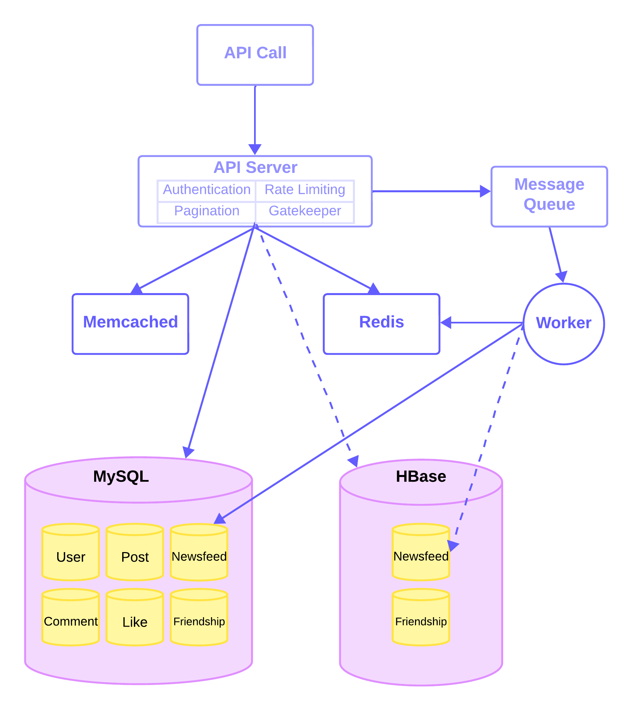

**WeConnect: Backend Web Application for a Social Networking Platform**
+ [1. Introduction](#introduction)
+ [2. Architecture Overview](#Architecture Overview)
+ [3. Virtual Environment Setup](#Virtual Environment Setup)
+ [4.Database System] (#Database System)

### 1. Introduction
+ **Technologies: Python, Django, MySQL, HBase, Redis, Memcached, Docker**
+ Developed the backend for a social networking platform using **Django**, deployed within a **Docker environment**, and implemented **RESTful APIs** for user accounts, posts, comments, friendships, likes, and newsfeeds.
+ Utilized **MySQL** and **HBase** for data storage, and employed **Redis** and **Memcached** for caching various types of data.
+ Implemented a **push model** for newsfeed fanout and leveraged **Redis** and **Celery** for asynchronous task processing.

### 2. Architecture Overview



### 3. Virtual Environment Setup
```
***** (1) docker setup *****
#download docker and check docker version
docker --version
docker info

#get ubuntu mirror
docker pull ubuntu:18.04
docker run -v "/django_social_network:/vagrant" -i -t --name mineos ubuntu:18.04 bash

#check system version
root@e928d367d8f1:/# cat /etc/issue
#Ubuntu 18.04.6 LTS \n \l

apt install vim
apt update
apt install python3 python3-pip wget dos2unix sudo lsb-release

#update root pw
root@e928d367d8f1:/# passwd root

#create sudo user
root@e928d367d8f1:/vagrant# adduser 'username'

root@e928d367d8f1:/vagrant# usermod -aG sudo 'username'
su - 'username'

#copy provision.sh and requirements.txt to the shared folder
cd /vagrant
dos2unix provision.sh
dos2unix requirements.txt

chmod +x provision.sh
./provision.sh

#add environment variable
echo 'export PATH="$HOME/.local/bin:$PATH"' >> ~/.bashrc
source ~/.bashrc

***** (2) Connect to Virtual Environment *****
docker ps
docker exec -it mineos /bin/bash
su - 'username'
cd /vagrant

***** (3) Initial Django Project *****
#1. project initiate
django-admin startproject social_network

#2. update social_network/setting.py -> DATEBASES
#3. execute migrate
cd social_network
pip install mysqlclient
python manage.py migrate

#4. run mySQL
mysql -u root -p #mySQL login
show tables;
+----------------------------+
| Tables_in_social_network   |
+----------------------------+
| auth_group                 |
| auth_group_permissions     |
| auth_permission            |
| auth_user                  |
| auth_user_groups           |
| auth_user_user_permissions |
| django_admin_log           |
| django_content_type        |
| django_migrations          |
| django_session             |
+----------------------------+

#5.install django rest framework
pip install djangorestframework

#6. run the project
python manage.py runserver 0.0.0.0:8000
```
#### 2. Modules
  + **Account**
    ```
    python manage.py startapp accounts
    cd accounts/
    mkdir api
    #create views and serializers
    touch views.py
    touch serializers.py
    
    ```
#### 3. Database
  ```
mysql> SHOW TABLES;
+----------------------------+
| Tables_in_social_network   |
+----------------------------+
| accounts_userprofile       |
| comments_comment           | 
| friendships_friendship     |
| likes_like                 |
| newsfeeds_newsfeed         |
| tweets_tweet               |
| tweets_tweetphoto          |
+----------------------------+
  ```
#### 4. Cache Management
```
# define and manage multi-container Docker applications: Memcached and Redis
#docker-compose -f docker-compose-tools.yaml up

(1) Memcached
'''
use Memcached to store friendships and users
'''

```
